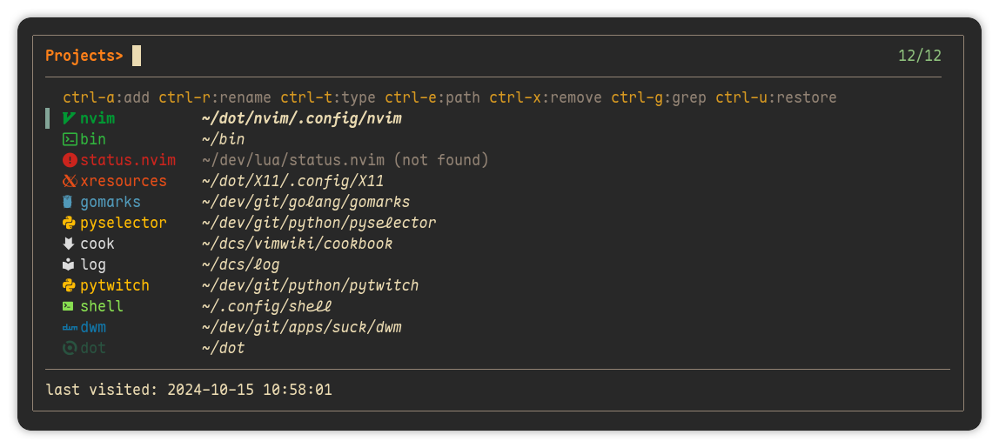

# 💥 Projects fzf

Simple [fzf-lua](https://github.com/ibhagwan/fzf-lua.git) project manager.

> [!WARNING]
> This plugin is _beta_ quality. Expect breaking changes and many bugs


<div align="left">
  
</div>

## Installation

### [lazy.nvim](https://github.com/folke/lazy.nvim)

```lua
{
  'haaag/projects.nvim',
  dependencies = { 'ibhagwan/fzf-lua' },
  opts = {},
  keys = {
    { '<leader>sp', '<CMD>FzfLuaProjects<CR>', desc = 'search projects' },
  },
  enabled = true,
}
```

<details>
<summary><strong>Default configuration</strong></summary>

```lua
require('projects').setup({
  -- `user-command` in neovim
  cmd = 'FzfLuaProjects',
  -- file store ($XDG_DATA_HOME/nvim || ~/.local/share/nvim)
  fname = vim.fn.stdpath('data') .. '/nvim-projects.txt',
  -- fzf's prompt
  prompt = 'Projects> ',
  -- preview
  previewer = false,
  -- icons
  icons = {
    default = '',
    warning = '',
    color = '#6d8086',
    enabled = true,
  },
  -- enable color output
  color = true,
  -- keybinds
  keymap = {
    add = 'ctrl-a',
    edit_path = 'ctrl-e',
    edit_type = 'ctrl-t',
    grep = 'ctrl-g',
    remove = 'ctrl-x',
    rename = 'ctrl-r',
    restore = 'ctrl-u',
  },
})
```

</details>
